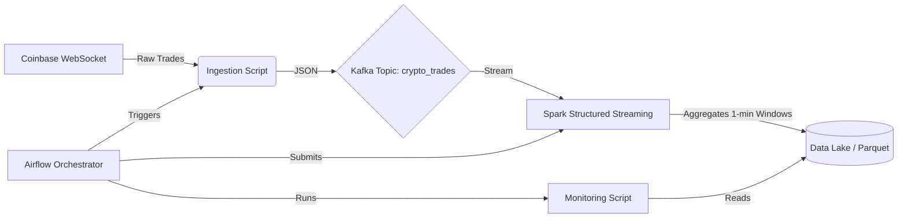

# Real-Time Crypto Data Pipeline

A request-driven, fault-tolerant ETL pipeline that ingests real-time cryptocurrency trade data, processes it using Apache Spark Structured Streaming, and stores aggregated OHLC (Open, High, Low, Close) metrics in a Data Lake.

## 🏗 Architecture



## 🚀 Key Features

-   **Real-Time Ingestion**: Connects to Coinbase WebSocket API to consume live trade data for `BTC-USD` and `ETH-USD`.
-   **Fault Tolerance**: Uses Apache Kafka as a durable buffer between ingestion and processing.
-   **Stream Processing**: PySpark Structured Streaming calculates 1-minute OHLC candles with watermark handling for late data.
-   **Orchestration**: Apache Airflow manages the pipeline lifecycle, handling job submissions and dependencies.
-   **Data Lake**: Stores processed metrics in efficient Parquet format for downstream analysis.

## 🛠 Tech Stack

-   **Language**: Python 3.9
-   **Ingestion**: `websocket-client`
-   **Message Broker**: Apache Kafka (Confluent Platform)
-   **Processing**: Apache Spark 3.5.0 (PySpark)
-   **Orchestration**: Apache Airflow 2.6.0
-   **Infrastructure**: Docker & Docker Compose

## 🏃‍♂️ Getting Started

### Prerequisites

-   Docker Desktop (giving at least 4GB RAM to Docker)
-   Python 3.9+ (for local script testing)

### Installation

1.  Clone the repository:
    ```bash
    git clone https://github.com/your-repo/crypto-pipeline.git
    cd crypto-pipeline
    ```

2.  Start the infrastructure:
    ```bash
    docker-compose up -d
    ```
    *This will spin up Zookeeper, Kafka, Spark Master/Worker, Airflow Webserver/Scheduler, and Postgres.*

3.  Access the services:
    -   **Airflow UI**: [http://localhost:8080](http://localhost:8080) 
    -   **Spark Master**: [http://localhost:9090](http://localhost:9090)

### Running the Pipeline

1.  Open the **Airflow UI**.
2.  Enable the `crypto_pipeline_orchestrator` DAG.
3.  Trigger the DAG manually.
    -   This will first start the ingestion task (listening to Coinbase).
    -   Concurrently submit the Spark Streaming job to the Spark Cluster.
    -   Once finished (or upon timeout), run the monitoring script.

### Verifying Output

Processed data is stored in the local `data_lake` directory:

```bash
ls -R data_lake/ohlc_data
```

You can read these files using any Parquet viewer or the provided monitoring script:

```bash
python scripts/monitor_alerts.py
```

## 📂 Project Structure

```
├── dags/
│   ├── crypto_ingestion_dag.py    # Airflow DAG for WebSocket ingestion
│   └── crypto_pipeline_dag.py     # Master DAG for orchestration
├── jobs/
│   └── spark_stream.py            # PySpark Structured Streaming logic
├── scripts/
│   ├── crypto_check.py            # Utility to test WebSocket connectivity
│   └── monitor_alerts.py          # Script to check data lake for anomalies
├── data_lake/                     # Local storage for Parquet files
├── docker-compose.yaml            # Infrastructure definition
└── requirements.txt               # Python dependencies
```